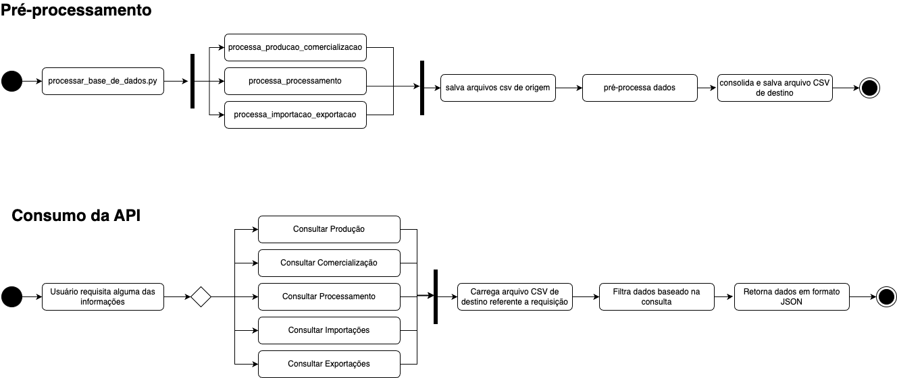

# API de Dados de Vitivinicultura

Esta API foi criada com o intuito de proporcionar um meio prático para acessar e analisar dados relacionados à vitivinicultura, coletados pela Embrapa. Por meio desta API, é possível consultar informações, como:

## Produção
Consultas sobre a produção de uvas em várias regiões do Brasil, incluindo:
- Ano de produção
- Volume produzido
- Variedades de uva

## Processamento
Detalhes sobre os processos de transformação das uvas, incluindo:
- Tipo de processamento
- Ano de processamento
- Quantidade processada

## Comercialização
Informações sobre a comercialização das uvas, como:
- Ano de transação
- Tipos de comercialização
- Volumes comercializados
- Valores financeiros
- Países de destino

## Importação
Dados relativos à importação de uvas, com informações sobre:
- Ano de importação
- Países de origem
- Tipos de produto
- Quantidades importadas
- Valores financeiros

## Exportação
Informações sobre as exportações de uvas, incluindo:
- Ano de exportação
- Países de destino
- Tipos de produto
- Volumes exportados
- Valores financeiros

Esses pontos de consulta são projetados para oferecer um panorama detalhado das atividades relacionadas à vitivinicultura, facilitando o acesso a dados importantes para análise e tomada de decisão.

## Objetivo da API

A principal finalidade desta API é prover a consulta a dados previamente processados e que facilitem a execução de tarefas de aprendizagem de máquina.

## Arquitetura


## Recursos adicionais:

- [Embrapa - Base de Dados Original](http://vitibrasil.cnpuv.embrapa.br/index.php?opcao=opt_01)
- [Pandas  Framework](https://pandas.pydata.org/pandas-docs/version/2.1/index.html)
- [Flask Framework](https://flask.palletsprojects.com/en/stable/)

## Endpoints

- `http://127.0.0.1:8000/app/v1/producao`
- `http://127.0.0.1:8000/app/v1/comercializacao`
- `http://127.0.0.1:8000/app/v1/processamento`
- `http://127.0.0.1:8000/app/v1/importacao`
- `http://127.0.0.1:8000/app/v1/exportacao`

### Filtros disponíveis
Você pode usar os seguintes filtros nas consultas:

- `ano`: Ano da produção, comercialização, processamento, importação ou exportação.
- `cod_produto`: Código do produto (ex.: vinho de mesa, tinto, etc.).
- `control`: Filtro para o tipo de controle (aplicável apenas para o endpoint de `processamento`).
- `pais`: País relacionado à importação ou exportação.
- `tipo`: Tipo de processamento ou importação/exportação.

Exemplo:
- `http://<host>:8000/api/v1/producao?ano=1970&cod_produto=vinho_de_mesa`

### 1. **Produção**
- **URL**: `/producao`
- **Método**: `GET`

Retorna dados sobre a produção de uvas no Brasil, com informações como ano, produto e litros produzidos.

##### Exemplo de resposta:
```json
[
  {"cod_produto,produto,ano,litros":"vinho_de_mesa,vinho_de_mesa,1970,217208604"},
  {"cod_produto,produto,ano,litros":"vinho_mesa_tinto,tinto,1970,174224052"},
  {"cod_produto,produto,ano,litros":"vinho_mesa_branco,branco,1970,748400"}
]
```

#### 2. Comercialização
- **URL**: `/comercializacao`
- **Método**: `GET`

##### Exemplo de resposta:
```json
[
  {"cod_produto,produto,ano,litros":"vinho_de_mesa,vinho_de_mesa,1970,98327606"},
  {"cod_produto,produto,ano,litros":"vinho_mesa_tinto,tinto,1970,83300735"},
  {"cod_produto,produto,ano,litros":"vinho_mesa_rosado,rosado,1970,107681"}
]
```

#### 3. Processamento
- **URL**: `/processamento`
- **Método**: `GET`

##### Exemplo de resposta:
```json
[
  {"control":"tintas","ano":1970,"quantidade_kg":"10448228","type":"processamento_viniferas"},
  {"control":"tintas_alicantebouschet","ano":1970,"quantidade_kg":"0","type":"processamento_viniferas"}
]
```

#### 4. Importação
- **URL**: `/importacao`
- **Método**: `GET`

##### Exemplo de resposta:
```json
[
  {"pais":"africa do sul","ano":1970,"quantidade_valor":0.0,"quantidade_kg":0,"type":"importacao_vinhos_de_mesa"},
  {"pais":"alemanha","ano":1970,"quantidade_valor":30498.0,"quantidade_kg":52297,"type":"importacao_vinhos_de_mesa"}
]
```

#### 4. Exportação
- **URL**: `/exportacao`
- **Método**: `GET`

##### Exemplo de resposta:
```json
[
  {"pais":"afeganistao","ano":1970,"quantidade_valor":0.0,"quantidade_kg":0.0,"type":"exportacao_vinhos_de_mesa"},
  {"pais":"africa do sul","ano":1970,"quantidade_valor":0.0,"quantidade_kg":0.0,"type":"exportacao_vinhos_de_mesa"}
]
```

## Plano de Deploy da API de Vitivinicultura

Imagem

## 1. **Processo de Extração de Dados**

### Cron Job
- **Objetivo**: Executar automaticamente a extração de dados de forma programada.
- **Descrição**: Um cron job é configurado para rodar uma vez por semana e disparar o processo de extração dos dados da Embrapa. O job executa o download, limpeza e transformação dos dados. Os scripts de extração são os mesmos utilizados na extração manual deste desenvolvimento.

## 2. **Armazenamento de Dados**

### Banco de Dados
- **Objetivo**: Armazenar os dados processados.
- **Descrição**: Usaremos um banco de dados simples (por exemplo, PostgreSQL ou MySQL) para armazenar os dados processados. A API acessa esse banco para fornecer os dados aos usuários.

## 3. **Deploy da API**

### Docker
- **Objetivo**: Containerizar a API para facilitar o deploy e a portabilidade.
- **Descrição**: A API é empacotada em um container Docker, garantindo que o ambiente de execução seja consistente e independente da máquina de deploy.

### Dockerfile
- **Objetivo**: Construir a imagem Docker.
- **Descrição**: O `Dockerfile` contém as instruções para criar uma imagem Docker da API. Isso inclui:
  - Instalar as dependências necessárias.
  - Copiar o código da API para o container.
  - Configurar o banco de dados e as variáveis de ambiente.

### docker-compose.yml
- **Objetivo**: Orquestrar a API e o banco de dados.
- **Descrição**: O `docker-compose.yml` facilita a configuração e execução simultânea da API e do banco de dados em containers Docker. Apenas dois serviços são definidos:
  - **API**: O container que executa a aplicação da API.
  - **Banco de Dados**: O banco de dados (ex. PostgreSQL).

### Plataforma de Deploy
- **Objetivo**: Hospedar a API na nuvem.
- **Descrição**: A API será publicada em uma plataforma de nuvem simples como **AWS EC2**, **Heroku**, ou **Google Cloud**. Isso garante alta disponibilidade e escalabilidade sem necessidade de gerenciar infraestrutura complexa.

## 4. **Monitoramento Básico**

### Logs e Monitoramento
- **Objetivo**: Monitorar o comportamento da API em produção.
- **Descrição**: 
  - **Logs**: A API gera logs simples que podem ser visualizados para diagnosticar erros e monitorar o comportamento.
  - **Monitoramento**: Usaremos ferramentas simples, como **Grafana** para visualizar métricas básicas (como tempo de resposta e número de requisições). Essas métricas podem ser coletadas através de logs ou ferramentas básicas como **Prometheus**.

## 5. **CI/CD Simplificado**

### Git
- **Objetivo**: Controle de versão do código.
- **Descrição**: O código da API é mantido em um repositório Git (GitHub, GitLab, etc.). Isso permite fácil colaboração e versionamento.

### CI/CD (GitHub Actions / GitLab CI)
- **Objetivo**: Automatizar o build e deploy.
- **Descrição**: Usaremos uma ferramenta CI/CD simples (como **GitHub Actions** ou **GitLab CI**) para automatizar o processo de build e deploy. Isso inclui:
  - **Build**: Construção da imagem Docker.
  - **Deploy**: Automação do deploy na plataforma de nuvem quando houver atualizações no código.

## 6. **Fluxo Simplificado do Deploy**

1. **Extração de Dados**: O cron job executa os scripts de extração e transformação dos dados todos os dias.
2. **Armazenamento**: Os dados processados são armazenados em um banco de dados.
3. **API Dockerizada**: A API é containerizada em Docker e executada em um servidor na nuvem.
4. **Monitoramento**: Logs e métricas básicas são coletados e monitorados para garantir a saúde da API.
5. **CI/CD**: O código é versionado no Git, e o processo de deploy é automatizado com CI/CD para garantir a rapidez e confiabilidade nas atualizações.
